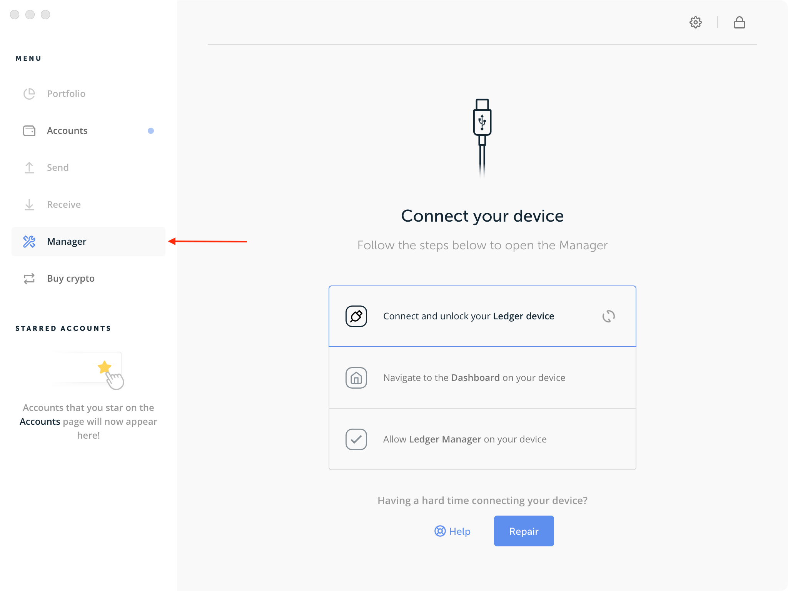

# Ledger Nano Support

It is recommended to have a basic understanding of the [IRISnet Key](../concepts/key.md) before using the ledger.

## Ledger Support for account keys

At the core of a Ledger device, there is a mnemonic that is used to generate private keys. When you initialize you Ledger, a mnemonic is generated.

::: danger
**Do not lose or share your 24 words with anyone. To prevent theft or loss of funds, it is best to ensure that you keep multiple copies of your mnemonic, and store it in a safe, secure place and that only you know how to access. If someone is able to gain access to your mnemonic, they will be able to gain access to your private keys and control the accounts associated with them.**
:::

This mnemonic is compatible with IrisNet accounts. The tool used to generate addresses and transactions on the IrisNet network is called `iris`, which supports derivation of account keys from a Ledger seed. Note that the Ledger device acts as an enclave of the seed and private keys, and the process of signing transaction takes place within it. No private information ever leaves the Ledger device.

To use `iris` with a Ledger device you will need the following(Since IRISnet is based on cosmos-sdk, the COSMOS app is available for IRISnet):

- [A Ledger Nano with the `COSMOS` app installed and an account.](#using-a-ledger-device)
- [A running `iris` instance connected to the network you wish to use.](../get-started/mainnet.md)
- [A `iris` instance configured to connect to your chosen `iris` instance.](../cli-client/intro.md)

Now, you are all set to start sending transactions on the network.

At the core of a ledger device, there is a mnemonic used to generate accounts on multiple blockchains (including the IRISnet). Usually, you will create a new mnemonic when you initialize your ledger device.

Next, learn how to generate an account.

## Generate an account

To create an account, you just need to have `iris` installed. Before creating it, you need to know where you intend to store and interact with your private keys. The best options are to store them in an offline dedicated computer or a ledger device. Storing them on your regular online computer involves more risk, since anyone who infiltrates your computer through the internet could exfiltrate your private keys and steal your funds.

### Use a ledger device

::: warning
Only use Ledger devices that you bought factory new or trust fully
:::

When you initialize your ledger, a 24-word mnemonic is generated and stored in the device. This mnemonic is compatible with IRISnet and IRISnet accounts can be derived from it. Therefore, all you have to do is make your ledger compatible with `iris`. To do so, you need to go through the following steps:

1. Install [Ledger Live](https://www.ledger.com/pages/ledger-live) on your machine.
2. Using Ledger Live, [update your Ledger Nano S with the latest firmware](https://support.ledger.com/hc/en-us/articles/360002731113-Update-device-firmware).
3. On the Ledger Live application, navigate to the `Manager` menu. 
    
4. Connect your Ledger Nano device and allow Ledger Manager from it.
5. On the Ledger Live application, Search for `Cosmos`. 
    
6. Install the Cosmos application by clicking on `Install`.

Then, to create an account, use the following command:

```bash
iris keys add <keyName> --ledger
```

IRISnet uses [HD Wallets](../concepts/key.md). This means you can setup many accounts using the same Ledger seed. To create another account from your Ledger device, run (change the integer i to some value >= 0 to choose the account for HD derivation):

```bash
iris keys add <secondKeyName> --ledger --account <i>
```

### Send transaction

You are now ready to start signing and sending transactions. The following is an example of using iris to send a token transfer transaction.

```bash
iris tx bank send --help # to see all available options.
```

::: tip Be sure to unlock your device with the PIN and open the Cosmos app before trying to run these commands :::

Use the keyName you set for your Ledger key and iris will connect with the Cosmos Ledger app to then sign your transaction.

::: tip The `Cosmos` app only support amino-json sign mode now, you must add the flag `--sign-mode amino-json` to use it :::

```bash
iris tx send <keyName> <destinationAddress> <amount><denomination> --sign-mode amino-json
```
When prompted with confirm transaction before signing, Answer Y.

Next you will be prompted to review and approve the transaction on your Ledger device. Be sure to inspect the transaction JSON displayed on the screen. You can scroll through each field and each message. Scroll down to read more about the data fields of a standard transaction object.

Now, you are all set to start [sending transactions on the network](../cli-client/tx.md).